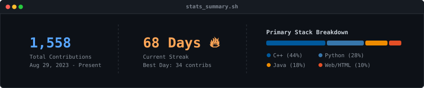

<h3><code>kenneth@github ~ $ ./contributions.sh</code></h3>

  

<h3><code>kenneth@github ~ $ whoami</code></h3>
<table>
  <tr>
    <td valign="top"></td>
    <td valign="top"></td>
  </tr>
</table>

 

<h1 align="center">Hi 👋, I'm Kenneth!</h1>
<h3 align="center">A passionate Software Developer from India 🇮🇳</h3>

  🔭 I’m currently improving my <b>DSA concepts &amp; Problem Solving</b> 
  🌱 Learning <b>C++, DSA, Java, and Python</b> 
  📫 How to reach me: <b><a href="mailto:kennethphilipajit@gmail.com">kennethphilipajit@gmail.com</a></b> 
  ⚡ Fun fact: <b>I’m truly passionate about sports, playing the guitar, and solving Rubik’s cubes. 🎸🏃‍♂️🧩</b>

 

<h3 align="center">📊 GitHub Statistics &amp; Activity</h3>

  

  

 

<h3 align="center">🛠️ Languages &amp; Tech Stack</h3>

  
  
  
  
  
  
  

 

<h3 align="center">🔗 Connect with me</h3>

  

