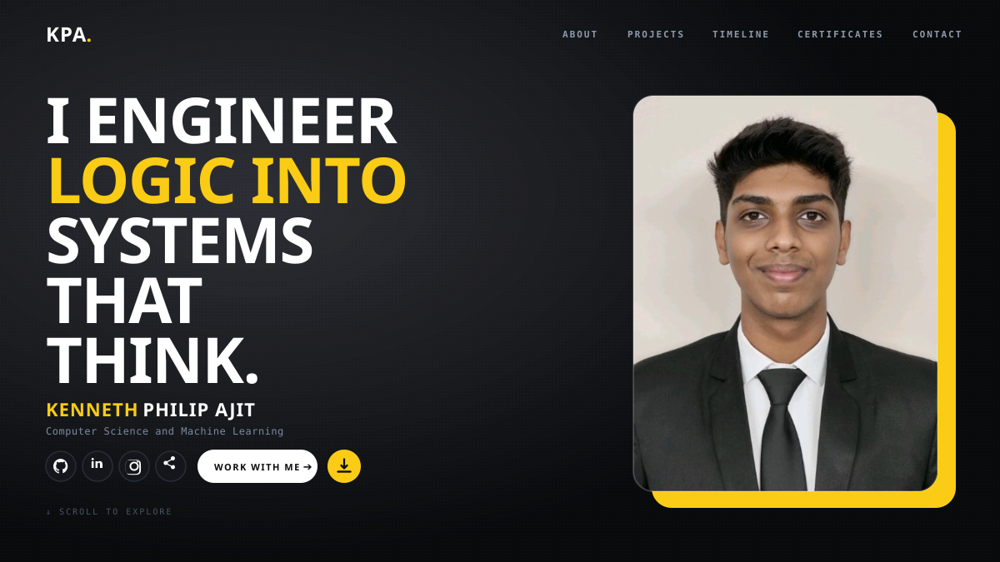

<!-- HERO PORTFOLIO SECTION -->

  

<!-- PORTFOLIO DIRECTORY / QUICK NAV -->
<table width="100%">
  <tr>
    <td align="center" width="20%"><b><a href="https://kennyy.me/#about">⚡ ABOUT</a></b></td>
    <td align="center" width="20%"><b><a href="https://kennyy.me/#projects">💻 PROJECTS</a></b></td>
    <td align="center" width="20%"><b><a href="https://kennyy.me/#timeline">⏳ TIMELINE</a></b></td>
    <td align="center" width="20%"><b><a href="https://kennyy.me/#certificates">🏆 CERTIFICATES</a></b></td>
    <td align="center" width="20%"><b><a href="https://kennyy.me/#contact">📬 CONTACT</a></b></td>
  </tr>
</table>

  

<h3><code>kenneth@github ~ $ ./contributions.sh</code></h3>

  

<h3><code>kenneth@github ~ $ whoami</code></h3>
<table>
  <tr>
    <td valign="top" width="45%"></td>
    <td valign="top" width="55%"></td>
  </tr>
</table>

 

<h1 align="center">Hi 👋, I'm Kenneth!</h1>
<h3 align="center">A passionate Software Developer from India 🇮🇳</h3>

  🔭 I’m currently building high-performance applications &amp; mastering <b>DSA &amp; Machine Learning</b> 
  🌱 Learning <b>C++, Java, Python, Systems Architecture, and Deep Learning</b> 
  📫 How to reach me: <b><a href="mailto:kennethphilipajit@gmail.com">kennethphilipajit@gmail.com</a></b> 
  🌐 Portfolio: <b><a href="https://kennyy.me" target="_blank">kennyy.me</a></b> 
  ⚡ Fun fact: <b>I’m truly passionate about sports, playing the guitar 🎸, running 🏃‍♂️, and solving Rubik’s cubes 🧩</b>

 

<!-- FEATURED PORTFOLIO HIGHLIGHTS -->
<h3 align="center">🌟 Portfolio Highlights &amp; Core Focus</h3>

<table width="100%">
  <tr>
    <td width="50%" valign="top">
      <h4>🧠 Machine Learning &amp; Logic</h4>
      <ul>
        <li>Engineering intelligent systems and algorithmic problem solving.</li>
        <li>Focusing on clean logic, optimized performance, and scalable ML workflows.</li>
      </ul>
    </td>
    <td width="50%" valign="top">
      <h4>💻 Full-Stack &amp; Systems</h4>
      <ul>
        <li>Building modern, dynamic user interfaces and resilient backends.</li>
        <li>Passion for Linux, low-level efficiency, and clean code architecture.</li>
      </ul>
    </td>
  </tr>
</table>

 

<h3 align="center">📊 GitHub Statistics &amp; Activity</h3>

  

  

 

<h3 align="center">🛠️ Languages &amp; Tech Stack</h3>

  
  
  
  
  
  
  

 

<h3 align="center">🔗 Connect with me</h3>

  
  &nbsp;
  
  &nbsp;
  

